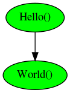
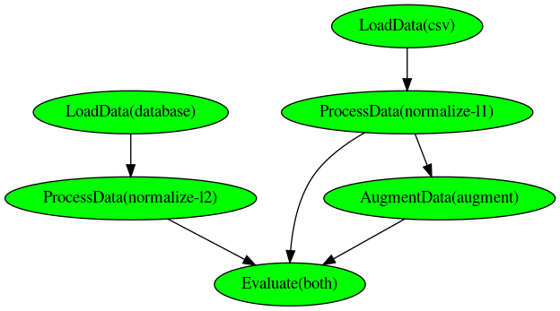

PypeRunner - Pure Python ETL Pipeline
#####################################
.. start-badges

.. image:: https://readthedocs.org/projects/pyperunner/badge/?version=latest
    :target: https://pyperunner.readthedocs.io/en/latest/?badge=latest
    :alt: Documentation Status

.. image:: https://badge.fury.io/py/pyperunner.svg
    :alt: PyPI Package latest release
    :target: https://pypi.org/project/pyperunner

.. image:: https://img.shields.io/pypi/pyversions/pyperunner.svg
    :alt: Supported Python Versions
    :target: https://pypi.org/project/pyperunner/

.. image:: https://pepy.tech/badge/pyperunner
    :alt: Downloads
    :target: https://pepy.tech/project/pyperunner/

.. end-badges

PypeRunner is an easy to use yet powerful workflow pipeline tool written in pure python, with parallel processing of tasks, smart
caching of results and reproducible runs.
PypeRunner allows for the creation of complex workflows with branching and merging of several concurrent execution flows.

Features
========

- Easy to use extract, transform load (ETL) pipeline tool
- Reproducible pipeline runs for data science / machine learning tasks
- Easy creation of pipelines using functional API chaining (see below)
- Parallel processing of steps
- Caching of previously run steps to speed up processing
- Re-run of steps (and all subsequent steps) when parameters are changed
- Save & read pipelines to/from yaml
- Graphical output of pipeline run

Installation
============

Install from pip via

.. code-block:: bash

    pip install pyperunner

Or from source via

.. code-block:: bash

    git clone https://github.com/glichtner/pyperunner.git
    cd pyperunner
    python setup.py install

Quickstart
==========

Pyperunner has three basic components:

* **Task**: Definition of the work to do (Python classes or functions)
* **Pipeline**: A collection of tasks that are connected in a directed fashion
* **Runner**: The executor of a pipeline

Hello world example
-------------------

.. code-block:: python

    from pyperunner import Runner, Pipeline, task

    @task("Hello", receives_input=False)
    def hello():
        print("in hello()")
        return "Hello"

    @task("World")
    def world(data):
        hello = data["Hello()"]
        print("in world()")
        return f"{hello} world"

    # instantiate and connect tasks
    hello = hello()
    world = world()(hello)

    # create pipeline and set root element
    pipeline = Pipeline("hello-world-example", [hello])

    # print a summary of the pipeline
    pipeline.summary()

    # run pipeline
    runner = Runner(data_path="data/", log_path="log/")
    runner.run(pipeline)

    # get pipeline results object from the pipeline that was just run
    results = runner.results()

    # show the results
    for task_name in results:
        print(f"Output of task '{task_name}' was '{results[task_name]}'")

Running this script outputs the following:

.. code-block:: console

    ~/pyperunner/examples$ python hello-world-func.py

    +---------+
    | Hello() |
    +---------+
          *
          *
          *
    +---------+
    | World() |
    +---------+

    2021-01-03 20:55:47 INFO     MainProcess  root       Storing pipeline parameters in examples/log/hello-world-example_210103T205547/pipeline.yaml
    2021-01-03 20:55:47 INFO     MainProcess  root       Storing pipeline data in examples/data
    2021-01-03 20:55:47 INFO     Process-1    Hello()    Starting
    2021-01-03 20:55:47 INFO     Process-1    Hello()    in hello()
    2021-01-03 20:55:47 INFO     Process-1    Hello()    Finished: Status.SUCCESS
    2021-01-03 20:55:47 INFO     Process-2    World()    Starting
    2021-01-03 20:55:47 INFO     Process-2    World()    in world()
    2021-01-03 20:55:47 INFO     Process-2    World()    Finished: Status.SUCCESS
    2021-01-03 20:55:47 INFO     MainProcess  root       Pipeline run finished

    Output of task 'Hello()' was 'Hello'
    Output of task 'World()' was 'Hello world'

Note that if you re-run the script, pyperunner will detect that the current configuration has already run and
will skip the execution of these tasks:

.. code-block:: console

    ~/pyperunner/examples$ python hello-world.py

    2021-01-03 20:56:36 INFO     MainProcess  root       No need to execute task "Hello()", skipping it
    2021-01-03 20:56:36 INFO     MainProcess  root       No need to execute task "World()", skipping it
    2021-01-03 20:56:36 INFO     MainProcess  root       Pipeline run finished

If you need to reprocess outputs, just add the `force_reload=True` parameter to the pipeline run:

.. code-block:: python

    runner.run(pipeline, force_reload=True)

Or to run just a specific task again, use the `reload=True` parameter when initializing the task:

.. code-block:: python

    # instantiate and connect tasks
    hello = hello()
    world = world(reload=True)(hello)

Note that pyperunner detects which tasks it must re-execute: All depending tasks of a reloaded task are automatically
re-executed, and only those tasks are fully skipped from execution from which the output is not required in a successor
task. Also, if a task has been previously executed and its output is required, it is read from disk.

.. code-block:: console

    ~/pyperunner/examples$ python hello-world.py

    2021-01-03 20:57:26 INFO     Process-1    Hello()    Starting
    2021-01-03 20:57:26 INFO     Process-1    Hello()    Loading output from disk, skipping processing
    2021-01-03 20:57:26 INFO     Process-1    Hello()    Finished: Status.SUCCESS
    2021-01-03 20:57:26 INFO     Process-2    World()    Starting
    2021-01-03 20:57:26 INFO     Process-2    World()    in world()
    2021-01-03 20:57:26 INFO     Process-2    World()    Finished: Status.SUCCESS
    2021-01-03 20:57:26 INFO     MainProcess  root       Pipeline run finished

At each run, the pipeline is automatically stored in a yaml file in the log path to ensure reproducibility:

.. code-block:: yaml

    pipeline:
      name: hello-world-example
    tasks:
      Hello():
        hash: 22179f3afd85ab64dd32c63bc21a9eb4
        module: __main__
        name: Hello
        params: {}
        parents: []
        tag: ''
      World():
        hash: f7d904856f2aa4fda20e05521298397f
        module: __main__
        name: World
        params: {}
        parents:
        - Hello()
        tag: ''

Additionally, a graphical representation of the run is saved in the log path:

Documentation
=============

The `API Reference <http://pyperunner.readthedocs.io>`_ provides API-level documentation.

Examples
========

Look in the examples/ directory for some example scripts.

Multiple paths pipeline
-----------------------
.. code-block:: python

   # Create pipeline
    pipeline = Pipeline("my-pipeline")

    # Create first stream of tasks: LoadData(csv) --> ProcessData(normalize-l2)
    load_db = LoadData(
        "database",
        database={"host": "localhost", "username": "user", "password": "password"},
        wait=10,
    )
    norm_l2 = ProcessData("normalize-l2", norm="l2", axis=0, wait=1)(load_db)

    # Create second stream of tasks:
    #  LoadData(csv) --> ProcessData(normalize-l1) --> AugmentData(augment)
    load_csv = LoadData("csv", filename="data.csv", wait=1)
    norm_l1 = ProcessData("normalize-l1", norm="l1", wait=1)(load_csv)
    augment = AugmentData("augment", types=["rotate", "noise"], wait=1)(norm_l1)

    # Combine outputs of both streams (ProcessData(normalize-l2)
    # and AugmentData(augment)), additionally add output from ProcessData(normalize-l1)
    evaluate = Evaluate("both", wait=1)([norm_l1, norm_l2, augment])

    # Add the roots of both streams to the pipeline
    pipeline.add(load_db)
    pipeline.add(load_csv)

    # print a summary of the pipeline
    pipeline.summary()

    # Run pipeline
    runner = Runner(data_path="data/", log_path="log/")
    runner.run(pipeline, force_reload=False)

`pipeline.summary()` prints the following ascii summary:

.. code-block:: raw

                                                                          +---------------+
                                                                          | LoadData(csv) |
                                                                          +---------------+
                                                                                  *
                                                                                  *
                                                                                  *
        +--------------------+                                      +---------------------------+
        | LoadData(database) |                                      | ProcessData(normalize-l1) |
        +--------------------+                                      +---------------------------+
                  *                                                    ***                  ***
                  *                                                ****                        ***
                  *                                              **                               ****
    +---------------------------+                 +----------------------+                          ****
    | ProcessData(normalize-l2) |                 | AugmentData(augment) |                   *******
    +---------------------------+****             +----------------------+            *******
                                     *******                  *                *******
                                            *******          *          *******
                                                   ****      *      ****
                                                    +----------------+
                                                    | Evaluate(both) |
                                                    +----------------+

Notice how multiple tasks run simultaneously:

.. code-block:: shell

    2021-01-03 19:09:05 INFO     Process-1    LoadData(csv)                  Starting
    2021-01-03 19:09:05 INFO     Process-2    LoadData(database)             Starting
    2021-01-03 19:09:06 INFO     Process-1    LoadData(csv)                  Finished: Status.SUCCESS
    2021-01-03 19:09:06 INFO     Process-3    ProcessData(normalize-l1)      Starting
    2021-01-03 19:09:07 INFO     Process-3    ProcessData(normalize-l1)      Finished: Status.SUCCESS
    2021-01-03 19:09:07 INFO     Process-4    AugmentData(augment)           Starting
    2021-01-03 19:09:08 INFO     Process-4    AugmentData(augment)           Finished: Status.SUCCESS
    2021-01-03 19:09:15 INFO     Process-2    LoadData(database)             Finished: Status.SUCCESS
    2021-01-03 19:09:15 INFO     Process-5    ProcessData(normalize-l2)      Starting
    2021-01-03 19:09:16 INFO     Process-5    ProcessData(normalize-l2)      Finished: Status.SUCCESS
    2021-01-03 19:09:16 INFO     Process-6    Evaluate(both)                 Starting
    2021-01-03 19:09:17 INFO     Process-6    Evaluate(both)                 Finished: Status.SUCCESS

