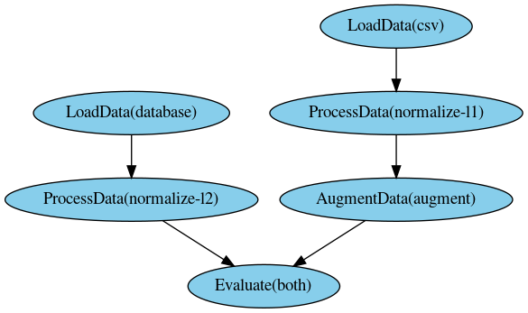

PypeRunner Components
#####################

PypeRunner has three main building blocks:

* :py:class:`~pyperunner.Task` define the work units
* :py:class:`~pyperunner.Pipeline` defines the order in which the tasks are executed
* :py:class:`~pyperunner.Runner` orchestrates the execution of tasks in a pipeline

Task
====
A task is the

Task Name
---------
The name of a task consists of its class name and an optional tag in the form of `<class-name>(<tag>)`. As the name
of each task in a pipeline must be unique, the tag can be used to use multiple instances of the same task in a pipeline.

.. code-block:: python

    @task('simple-task')
    def simpletask(data):
        return 'simple-task'

    first_task = simpletask(tag='first')
    second_task = simpletask(tag='second')

    print(first_task.name)
    # returns 'simple-task(first)'
    print(second_task.name)
    # return 'simple-task(sceond)'

Task Parameter
--------------
A task that receives data from an upstream task (i.e. all tasks that are not at the root / start of a pipeline) needs to
accept a `data` parameter, in which the upstream tasks' results will be provided to the task.
The input data is provided in a list, where each element of the list contains the result of one upstream task. For
example, if a task has three upstream (parent) tasks, then the `data` argument to the task's function will contain
three items, one from each upstream task. Please note that the order of elements in `data` is not guaranteed and the
upstream tasks need to supply identifying information in their result on their own, should that be required to
process their outputs in the downstream child task.

A task can have additional parameters. These need to be defined as the task's function (either in the function's
definition, if defining the task by a function, or in :py:func:`~pyperunner.Task.run`, if defining a task as a class)
and need to be specified during task creation time.
Additionally

Task Hash
---------
The task hash is an unique identifier of a task that takes into account both the task's parameter and the task's
environment in the pipeline (specifically: ALL upstream tasks). It is computed using the
:py:func:`~pyperunner.Task.hash` method.

The hash is constructed from the hash of the specific task and the hashes of *all* parent
(predecessor) tasks. It is therefore dependent on the pipeline the task is part of. This is used to precisely
identify a task in a given context (e.g. when saving and loading pipelines using the
:py:meth:`pyperunner.Pipeline.to_file` and :py:meth:`pyperunner.Pipeline.from_file` methods to store/load a
pipeline from file). It ensures reproducibility of single pipeline runs.

Memory consumption
------------------
Note that pyperunner executes each task in a separate process (using the python library multiprocessing) and
receives the results using a multiprocessing.Queue. Thus, memory consumption may be more than twice the size of actual
task return value as it must be stored both in the task and in the main process that receives the data.

Pipeline
========

A :py:class:`~pyperunner.Pipeline` describes the connections between tasks.

Runner
======
A :py:class:`~pyperunner.Runner` performs and orchestrates the actual execution of tasks. Pyperunner executes each
task in a separate process and can therefore inherently parallelize tasks.

Define Tasks
############
Tasks can be defined either from functions or by subclassing the :py:class:`~pyperunner.Task` class,
Which way to use depends on the complexity and organization of the task's code: For a simple
workflow a function usually suffices and is easier readable, while for complex workflows with
multiple function calls and the requirement to keep a state, a class might be the better choice.

Function as task
==================
To use a user-defined function as a task, simply tag it with the :py:func:`~pyperunner.task` decorator:

.. code-block:: python

    from pyperunner import task

    @task("MyTask")
    def my_function(data):
        result = do_something(data)
        return result

    # note that creating the task is performed by calling the function
    # but *without* the data argument.
    my_task = my_function()

The :py:func:`~pyperunner.task` decorator has a required positional parameter `name`, which is used as the name of the
task. It is required that each task in pipeline has a unique name.

The function that is decorated by the :py:func:`~pyperunner.task` decorator needs to either accept a named parameter
`data` or the task() decorator needs to be supplied a `receives_input=False` parameter.

.. code-block:: python

    # Create a task named "SimpleTask" - note that the function accepts
    # the `data` keyword parameter
    @task('SimpleTaskWithInput')
    def simpletask_with_input(data):
        return 'simple-task'

    # If the function should not accept data (i.e. be a starting task of the pipeline),
    # the `receives_input=False` parameter must be supplied to the task() decorator.
    @task('SimpleTaskWithoutInput', receives_input=False)
    def simpletask_without_input():
        return 'simple-task'

    # The following definition will raise an AttributeError
    @task('SimpleTaskError')
    def simpletask_without_input_error():
        return 'simple-task'
    # raises AttributeError: To receive input data, the function must accept
    # the named parameter "data"

You can add additional parameters to the function definition. These then need to be supplied during task creation time:

.. code-block:: python

    @task("MyTaskWithParameters")
    def my_function(data, reduce, n_iterations=10):
        result = data
        for i in range(n_iterations):
            result = do_something(result, reduce=reduce)

        return result

    # The task is created by calling the function but always *without*
    # the `data` argument.
    my_task = my_function(reduce=True, n_iterations=20)

    # Parameters with default values may be skipped during task creation
    my_task = my_function(reduce=True)

Class as task
==================
To use a class as a task, the class must inherit from the :py:class:`~pyperunner.Task` class, implement the abstract
:py:func:`~pyperunner.Task.run` function and use the :py:func:`~pyperunner.run` decorator on the `run()` implementation:

.. code-block:: python

    from pyperunner import Task, run

    class Hello(Task):
        @run
        def run(self, data):
            return "Hello"

    # Note that creating the task is performed by instantiating the class:
    my_task = Hello()

You can add additional parameters to the `run()` method definition. These then need to be supplied during task
creation time:

.. code-block:: python

    @task("MyTaskWithParameters")
    class SomeWorker(Task):
        @run
        def run(self, data, reduce, n_iterations=10):
            result = data
            for i in range(n_iterations):
                result = do_something(result, reduce=reduce)

            return result

    # The task is created by instantiating the class using the additional
    # parameters from the run function as parameters to the constructor
    # but always *without* the `data` argument.
    my_task = SomeWorker(reduce=True, n_iterations=20)

    # Parameters with default values may be skipped during task creation
    my_task = SomeWorker(reduce=True)

Combine Tasks to Pipeline
#########################

Standard Pipeline
==================
A :py:class:`~pyperunner.Pipeline` describes the connections between tasks. Create a pipeline using:

.. code-block:: python

    from pyperunner import Pipeline

    pipeline = Pipeline("my-pipeline")

Pyperunner offers a functional API to connect tasks and to add them to a pipeline:

.. code-block:: python

    @task('simple-task')
    def simpletask(data):
        return 'simple-task'

    # Reusing the same task using the "tag" parameter
    first_task = simpletask(tag='first')
    second_task = simpletask(tag='second')
    third_task = simpletask(tag='third')
    fourth_task = simpletask(tag='fourth')

    # connect tasks from first to fourth task
    fourth_task(third_task(second_task(first_task)))

    # and add the starting task to the pipeline
    pipeline.add(first_task)

Sequential Pipeline
========================
A :py:class:`~pyperunner.Sequential` pipeline is a wrapper for purely sequential (path) workflows. With sequential
pipelines, you can supply the whole pipeline as a list to the constructor. The tasks are automatically connected in
the supplied order and applied

.. code-block:: python

    @task('simple-task')
    def simpletask(data):
        return 'simple-task'

    # Reusing the same task using the "tag" parameter
    first_task = simpletask(tag='first')
    second_task = simpletask(tag='second')
    third_task = simpletask(tag='third')
    fourth_task = simpletask(tag='fourth')

    # create a sequential pipeline and supply whole pipeline as list in constructor
    pipeline = Sequential("sequential", [first_task, second_task, third_task, fourth_task])

Pipeline summary
================
Pyperunner offers two modes of visualizing the pipeline: As ASCII and as PNG:

.. code-block:: python

    # create pipeline and add tasks
    # ...

    # print an ASCII summary
    pipeline.summary()

This outputs an ASCII summary like this to the console:

.. code-block:: shell

                                                     +---------------+
                                                      | LoadData(csv) |
                                                      +---------------+
                                                              *
                                                              *
                                                              *
        +--------------------+                  +---------------------------+
        | LoadData(database) |                  | ProcessData(normalize-l1) |
        +--------------------+                  +---------------------------+
                  *                                           *
                  *                                           *
                  *                                           *
    +---------------------------+                 +----------------------+
    | ProcessData(normalize-l2) |                 | AugmentData(augment) |
    +---------------------------+                 +----------------------+
                            ****                  ***
                                ****          ****
                                    **      **
                               +----------------+
                               | Evaluate(both) |
                               +----------------+

The PNG image of the pipeline is created by the :py:class:`~pyperunner.Runner`, because it contains color-coded
information about the pipeline run

.. code-block:: python

    # Run pipeline
    runner = Runner(data_path="data/", log_path="log/")
    runner.run(pipeline)

    runner.write_status_image("status.img")

This outputs an image like this:

Save & load pipelines
========================
At each run, information about the pipeline is automatically saved to the log path as `pipeline.yaml`. To manually
save a pipeline, call the :py:meth:`~pyperunner.Pipeline.to_file` function of the pipeline

.. code-block:: python

    pipeline.to_file('my-pipeline.yml')

To load and fully reconstruct a previously saved pipeline, use the :py:meth:`~pyperunner.Pipeline.from_file` method:

.. code-block:: python

    from pyperunner import Pipeline, Runner

    pipeline = Pipeline.from_file('my-pipeline.yml')

    # re-run loaded pipeline
    runner = Runner(data_path='data/', log_path='log/')
    runner.run(pipeline)

.. note::

    To reconstruct a pipeline from yaml file, you must make sure that all Tasks used by the pipeline are
    defined/imported when calling :py:meth:`~pyperunner.Pipeline.from_file` and that the defined Tasks use the exact
    same modules and names as saved in the pipeline.
    This is because the pipeline tasks and their modules are stored as strings in the yaml file and only reconstructed
    from their names.

Run Pipeline
==================
To run a pipeline, instantiate a :py:class:`~pyperunner.Runner` and run the pipeline. You need to specify the
data and log paths for the runner, where data_path is the path where all outputs of the tasks are stored and
log_path is the path where log file from the actual pipeline run, along the pipeline definition as a yaml file, are
stored.

.. code-block:: python

    runner = Runner(data_path='data/', log_path='log/')
    runner.run(pipeline)

Access pipeline results
#######################
You have three options to access the pipeline results:
1. Using the :py:meth:`~pyperunner.Pipeline.results()` function after a pipeline run
2. Using the :py:meth:`pyperunner.PipelineResult.from_file` function on a stored pipeline run yaml file
3. Manually from the file system using joblib.load

pipeline.results
==================
After a pipeline run, you can access the results using :py:meth:`~pyperunner.Pipeline.results()` on the pipeline:

.. code-block:: python

    runner = Runner(data_path='data/', log_path='log/')
    runner.run(pipeline)

    list(pipeline.results())

    # outputs, for example:
    # [
    #   'AugmentData(augment)',
    #   'Evaluate(both)',
    #   'LoadData(csv)',
    #   'LoadData(database)',
    #   'ProcessData(normalize-l1)',
    #   'ProcessData(normalize-l2)'
    # ]

You can access the results from individual tasks using the task name as the key to the :py:meth:`pyperunner.PipelineResult` object:

.. code-block:: python

    for task_name in pipeline.results():
        print(pipeline[task_name])

PipelineResult
==================
To access the results of a pipeline at a later timepoint, use the :py:meth:`pyperunner.PipelineResult.from_file`
function on a stored pipeline run yaml file.

.. code-block:: python

    runner = Runner(data_path='data/', log_path='log/')
    runner.run(pipeline)

Example output:

.. code-block:: shell

    2021-01-23 17:23:18 INFO     MainProcess  root      Stored pipeline parameters in /home/glichtner/projects/pyperunner/log/my-pipeline_210123T172317/pipeline.yaml

Load the pipeline results:

.. code-block:: python

    from pyperunner import PipelineResult
    fname = "/home/glichtner/projects/pyperunner/log/my-pipeline_210123T172317/pipeline.yaml"

    results = PipelineResult.from_file(fname)

    # loop through individual task results
    for task_name in pipeline.results():
        print(pipeline[task_name])

Filesystem
==========
The outputs of tasks are dumped to the local filesystem using joblib.dump(). To load the output of a single task
manually, use joblib.load():

.. code-block:: python

    import joblib
    fname = "/home/glichtner/projects/pyperunner/data/Evaluate(both)/197f82a6dbc9799406a35bef412cd7f4/result.dump.gz"

    task_result = joblib.load(fname)

Reproducibility
###############
To ensure reproducibility, alongside the results of each task result, pyperunner stores the paramters used for that
task and also a hash of the parent/upstream tasks of that task.

Result Caching
###############
Pyperunner caches the outputs of a task and only executes a task if

 - The task hasn't been executed yet and there are no results available
 - The task is forced to be executed by specifying `reload=True` during task creation
 - All tasks are forced to be executed by using `force_reload=True` when calling :py:meth:`pyperunner.Runner.run`
 - Different parameters are used when instantiating the task
 - Any task upstream to the task in question has changed or is required to reload

Examples
========

Consider the following Sequential pipeline of four tasks:

.. code-block:: python

    @task('simple-task')
    def simpletask(data, param):
        return 'simple-task'

    # Reusing the same task using the "tag" parameter
    first_task = simpletask(tag='first', param=1)
    second_task = simpletask(tag='second', param=2)
    third_task = simpletask(tag='third', param=3)
    fourth_task = simpletask(tag='fourth', param=4)

    # create a sequential pipeline and supply whole pipeline as list in constructor
    pipeline = Sequential("sequential", [first_task, second_task, third_task, fourth_task])

    runner = Runner(data_path='data/', log_path='log/')
    runner.run(pipeline)

If these task haven't run before in the specified data_path, all 4 tasks are executed.
If running the pipeline directly again, no task will be executed, as all results have been cached in data_path and
nothing has changed:

.. code-block:: python

    runner.run(pipeline) # no task executed, all cached

If a task is recreated using the `reload` paramter, that task and all subsequent tasks are executed:

.. code-block:: python

    third_task = simpletask(tag='third', param=3, reload=True)

    # create a sequential pipeline and supply whole pipeline as list in constructor
    pipeline = Sequential("sequential", [first_task, second_task, third_task, fourth_task])

    runner.run(pipeline) # executes task 3 (because of reload=True) and 4 (because its upstream task changed)

All tasks can be executed by using the force_reload parameter on the runner:

.. code-block:: python

    # create a sequential pipeline and supply whole pipeline as list in constructor
    pipeline = Sequential("sequential", [first_task, second_task, third_task, fourth_task])

    runner.run(pipeline, force_reload=True) # executes all tasks

If any parameter of task is changed (and the task hasn't been executed using that parameter configuration), then
also that task and all dependent (downstream) tasks are executed:

.. code-block:: python

    # Reusing the same task using the "tag" parameter
    first_task = simpletask(tag='first', param=1)
    second_task = simpletask(tag='second', param='CHANGED') # this task uses a different parameter value
    third_task = simpletask(tag='third', param=3)
    fourth_task = simpletask(tag='fourth', param=4)

    # create a sequential pipeline and supply whole pipeline as list in constructor
    pipeline = Sequential("sequential", [first_task, second_task, third_task, fourth_task])

    runner.run(pipeline) # Executes task 2 (because of the changed parameter) and tasks 3 and 4
                         # (because an upstream task is executed)

